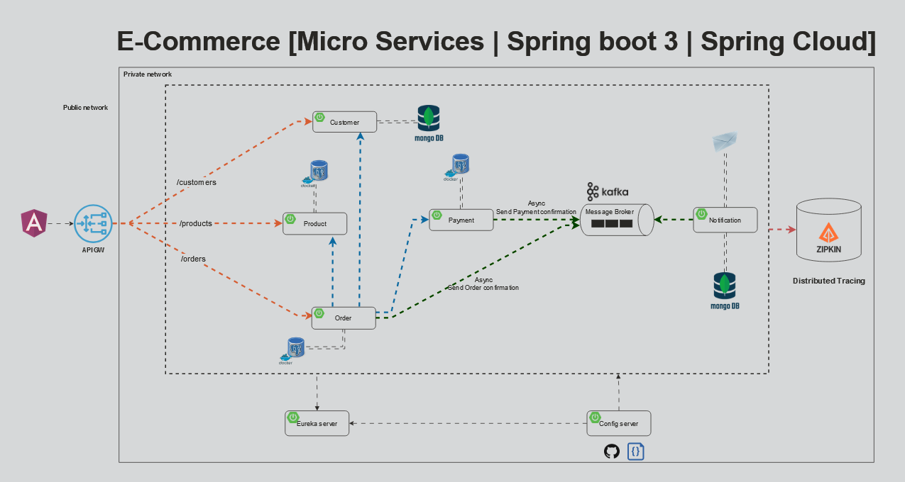

# Spring Boot Microservices Project

This project demonstrates a microservices architecture using Spring Boot, Keycloak for security, Kafka as a message broker, MongoDB and PostgreSQL for data storage, and Zipkin for distributed tracing.

## Technologies Used
- Spring Boot
- Keycloak
- Apache Kafka
- MongoDB
- PostgreSQL
- Zipkin

## Architecture


## Prerequisites
- JDK 11+
- Docker
- Docker Compose

## Setup
1. Clone the repository:
    ```bash
    git clone https://github.com/your-username/your-repo.git
    cd your-repo
    ```

2. Start the services using Docker Compose:
    ```bash
    docker-compose up
    ```

## Running the Application
1. Build and run the microservices:
    ```bash
    ./mvnw clean install
    ./mvnw spring-boot:run
    ```

2. Access the application:
    - Keycloak: `http://localhost:9098`
    - Zipkin: `http://localhost:9411`
    - maildev: `http://localhost:1080`

## License
This project is licensed under the MIT License - see the [LICENSE](LICENSE) file for details.
